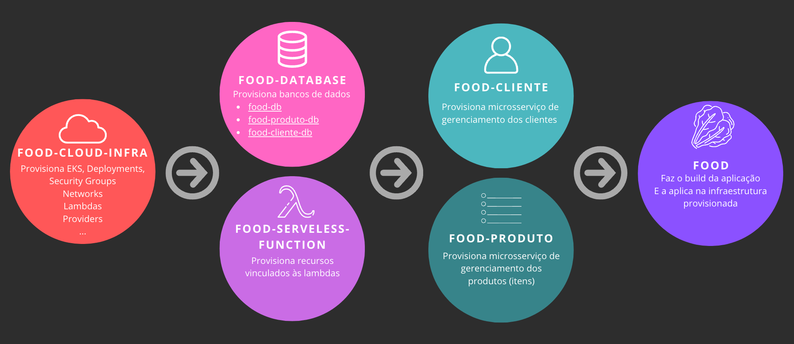

# Infraestrutura de bancos de dados - ALFAC

Este é um repositório Git que utiliza o Terraform para gerenciar a infraestrutura dos bancos de dados da aplicação [Fast Food - ALFAC](https://github.com/ALFAC-Org/food). Nele, você encontrará arquivos de configuração do Terraform que definem a infraestrutura do banco de dados como código. No momento, o repositório está focado na Amazon Web Services (AWS).

> [!WARNING]
> Para completo funcionamento da plataforma, é necessário seguir todo o fluxo de provisionamento:
> 1. A provisão da infraestrutura: [https://github.com/ALFAC-Org/food-cloud-infra](https://github.com/ALFAC-Org/food-cloud-infra);
> 2. A provisão deste repositório;
> 3. A provisão das lambdas: [https://github.com/ALFAC-Org/food-serveless-function](https://github.com/ALFAC-Org/food-serveless-function);
> 4. A provisão das aplicações:
>    1. [https://github.com/ALFAC-Org/food-cliente](https://github.com/ALFAC-Org/food-cliente);
>    2. [https://github.com/ALFAC-Org/food-produto](https://github.com/ALFAC-Org/food-produto);
> 5. E por fim, o provisionamento da aplicação principal em [https://github.com/ALFAC-Org/food](https://github.com/ALFAC-Org/food).

## Tutoriais

| Passo                                                                                                                                    | Vídeo   |
|------------------------------------------------------------------------------------------------------------------------------------------|---------|
| 0. Introdução geral                                                                                                                      | --      |
| 1. Introdução aos repositórios                                                                                                           | --      |
| 2. Configuração das variáveis ambiente                                                                                                   | --      |
| 3. Provisão da infraestrutura com [https://github.com/ALFAC-Org/food-cloud-infra](https://github.com/ALFAC-Org/food-cloud-infra)         | -- / -- |
| 4. Provisão dos bancos de dados com [https://github.com/ALFAC-Org/food-database](https://github.com/ALFAC-Org/food-database)             | -- / -- |
| 5. Provisão das lambdas com [https://github.com/ALFAC-Org/food-serveless-function](https://github.com/ALFAC-Org/food-serveless-function) | --      |
| 6. Provisão da aplicação food-produto [https://github.com/ALFAC-Org/food-produto](https://github.com/ALFAC-Org/food-produto)             | --      |
| 7. Provisão da aplicação food-cliente [https://github.com/ALFAC-Org/food-cliente](https://github.com/ALFAC-Org/food-cliente)             | --      |
| 8. Provisão da aplicação principal com [https://github.com/ALFAC-Org/food](https://github.com/ALFAC-Org/food)                            | --      |
| 9. Demonstrando tudo: Como interagir na plataforma                                                                                       | --      |

## Arquitetura

A aplicação contêm 3 bancos de dados, sendo eles:

- **Banco de dados de clientes** (os que optarem por se identificar):
  - Utilizando o MySQL _(relacional)_;
  - Trabalha em conjunto com o microsserviço [https://github.com/ALFAC-Org/food-cliente](https://github.com/ALFAC-Org/food-cliente) 
- **Banco de dados de produtos** (itens):
  - Utilizando o DynamoDB _(NoSQL)_;
  - Trabalha em conjunto com o microsserviço [https://github.com/ALFAC-Org/food-produto](https://github.com/ALFAC-Org/food-produto)
- **Banco de dados de pedidos** (principal):
  - Utilizando o MySQL _(relacional)_;
  - Trabalha em conjunto com o microsserviço [https://github.com/ALFAC-Org/food](https://github.com/ALFAC-Org/food);
  - Unifica as informações dos clientes e produtos.

## Como provisionar os bancos de dados

  
Banco de dados de clientes

Execute o worfklow `AWS - Cria food-cliente-db` em [https://github.com/ALFAC-Org/food-database/actions/workflows/create-food-cliente-db.yml](https://github.com/ALFAC-Org/food-database/actions/workflows/create-food-cliente-db.yml). 

Leva em torno de 5 minutos.

Veja as informações do mesmo dentro da AWS, no console de RDS.

  
Banco de dados de produtos (itens)

Execute o worfklow `AWS - Cria food-produto-db` em [https://github.com/ALFAC-Org/food-database/actions/workflows/create-food-produto-db.yml](https://github.com/ALFAC-Org/food-database/actions/workflows/create-food-produto-db.yml). 

Leva em torno de 1 minuto.

Veja as informações do mesmo dentro da AWS, no console de DynamoDB.

  
Banco de dados de pedidos (principal)

Execute o worfklow `AWS - Cria food-db` em [https://github.com/ALFAC-Org/food-database/actions/workflows/create-food-db.yml](https://github.com/ALFAC-Org/food-database/actions/workflows/create-food-db.yml). 

Leva em torno de 5 minutos.

Veja as informações do mesmo dentro da AWS, no console de RDS.

## Acessando a aplicação

Você saberá que tudo estará bem, quando acessar a aplicação principal [https://github.com/ALFAC-Org/food](https://github.com/ALFAC-Org/food) acessando a url do Load Balancer e então realizando um pedido ou obter alguma informação do sistema através do Swagger da aplicação principal ou a aplicação de relacionado a cada banco de dados.

## Membros

| Nome | RM | E-mail | GitHub |
| --- | --- | --- | --- |
| Leonardo Fraga | RM354771 | [rm354771@fiap.com.br](mailto:rm354771@fiap.com.br) | [@LeonardoFraga](https://github.com/LeonardoFraga) |
| Carlos Henrique Carvalho de Santana | RM355339 | [rm355339@fiap.com.br](mailto:rm355339@fiap.com.br) | [@carlohcs](https://github.com/carlohcs) |
| Leonardo Alves Campos | RM355568 | [rm355568@fiap.com.br](mailto:rm355568@fiap.com.br) | [@lcalves](https://github.com/lcalves) |
| Andre Musolino | RM355582 | [rm355582@fiap.com.br](mailto:rm355582@fiap.com.br) | [@amusolino](https://github.com/amusolino) |
| Caio Antunes Gonçalves | RM354913 | [rm354913@fiap.com.br](mailto:rm354913@fiap.com.br) | [@caio367](https://github.com/caio367) |