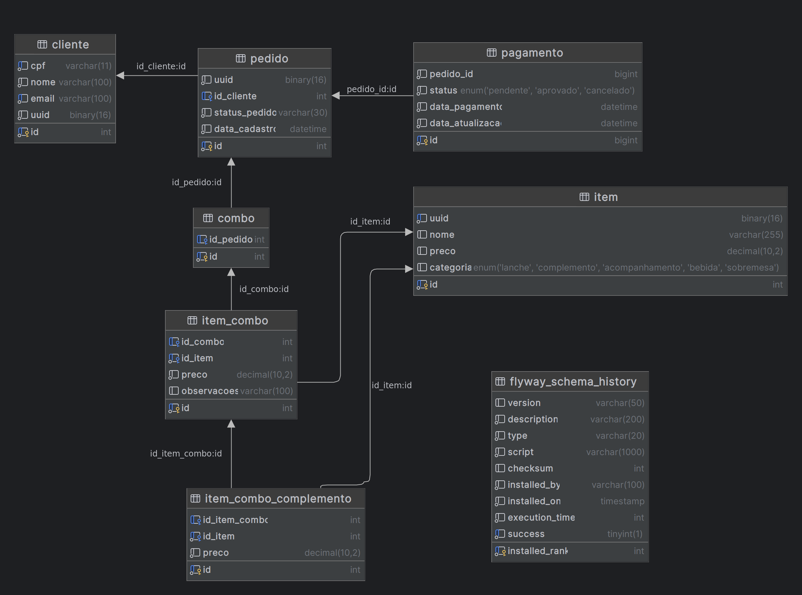

# Infraestrutura de banco de dados - ALFAC

Este é um repositório Git que utiliza o Terraform para gerenciar infraestrutura do banco de dados da aplicação [Fast Food - ALFAC](https://github.com/ALFAC-Org/food). Nele, você encontrará arquivos de configuração do Terraform que definem a infraestrutura do banco de dados como código. No momento, o repositório está focado na Amazon Web Services (AWS), usando o RDS. Entretanto, o repositório é flexível para adaptação para outros provedores de banco de dados.

> [!WARNING]  
> **Para completo funcionamento do sistema, é necessário seguir todo o fluxo de provisionamento: 1. A provisão do repositório de infraestrutura [https://github.com/ALFAC-Org/food-cloud-infra](https://github.com/ALFAC-Org/food-cloud-infra); 2. a provisão deste repositório; 3. A provisão das lambdas [https://github.com/ALFAC-Org/food-serveless-function](https://github.com/ALFAC-Org/food-serveless-function); 4. E por fim, a o provionamento da aplicação principal, utilizando de todos os recursos anteriormente criados em [https://github.com/ALFAC-Org/food](https://github.com/ALFAC-Org/food)**


## Tutoriais

| Passo | Vídeo |
|-------|-------|
| 0. Introdução geral | [0-INTRODUCAO-GERAL](https://drive.google.com/file/d/1E9v5AYdDJZeDYTBuxv9MxESB194wfX2q/view?usp=drive_link) |
| 1. Introdução aos repositórios | [1-INTRODUCAO-REPOSITORIOS](https://drive.google.com/file/d/1jViIPSCdinQ0Dbvf9VCHRd_qryEZiHdz/view?usp=drive_link) |
| 2. Configuração das variáveis ambiente | [2-CONFIGURACAO-VARIAVEIS](https://drive.google.com/file/d/1QnLUTGbsOQ0hj0cI0CifeCAwBANxmy98/view?usp=drive_link) |
| 3. Provisão da infraestrutura com [https://github.com/ALFAC-Org/food-cloud-infra](https://github.com/ALFAC-Org/food-cloud-infra) | [3-INFRA-PARTE-1](https://drive.google.com/file/d/1J10-wJGOLysgZtSyTtVhfSJG-YrguhAi/view?usp=drive_link) / [3-INFRA-PARTE-2](https://drive.google.com/file/d/1Tzztu_W3Qx5WZdocE49yRNigKO4W1qkz/view?usp=drive_link) |
| 4. Provisão do banco de dados com [https://github.com/ALFAC-Org/food-database](https://github.com/ALFAC-Org/food-database) | [4-DATABASE-PARTE-1](https://drive.google.com/file/d/1FyC0uFHNiWsP8tH7p_mdzSRgtFazag2E/view?usp=drive_link) / [4-DATABASE-PARTE-2](https://drive.google.com/file/d/1TCs5dfF6cqnvYOK5kZ-d5RKUbrv9zruI/view?usp=drive_link) |
| 5. Provisão do lambda com [https://github.com/ALFAC-Org/food-serveless-function](https://github.com/ALFAC-Org/food-serveless-function) | [5-LAMBDA](https://drive.google.com/file/d/1djIEy_YctnqSyXRNUPC45prQ0wwiZjks/view?usp=drive_link) |
| 6. Provisão da aplicação principal com [https://github.com/ALFAC-Org/food](https://github.com/ALFAC-Org/food) | [6-FOOD](https://drive.google.com/file/d/1wHJnIbI-bFn25VH4hmYfrrW0xTxSAfKv/view?usp=drive_link) |
| 7. Demonstrando tudo: API Gateway + Lambda + Load Balancer + EKS junto do fluxo do usuário | [7-FLUXO](https://drive.google.com/file/d/1vJRNaJK86aQIZCpjcT6Hqpxg4Aq9JREv/view?usp=drive_link) |


## Conceito

O banco de dados escolhido para essa aplicação foi o MySql, devido ao seu modelo relacional. Entenda motivos para esta escolha a seguir.

### Razões para usar um banco relacional (MySql)

- Estrutura de dados bem definida e com suporte a chaves estrangeiras. Isso permite garantirmos a consistência dos dados, como por exemplo, um pedido deve estar sempre associado a um cliente válido.
- A estrutura relacional facilita o gerenciamento de relacionamentos complexos entre diferentes entidades, como por exemplo, entre clientes, pedidos, itens e pagamentos.
- Alterações na estrutura dos dados, como adicionar novas colunas ou modificar os relacionamentos entre as tabelas, podem ser realizadas de forma controlada e com menor risco para o sistema.
- Embora a escalabilidade horizontal não seja uma opção, ainda podemos explorar a escalabilidade vertical. Além disso, para atender a necessidades futuras, poderíamos considerar a utilização de um banco de dados chave-valor com persistência em memória, como o Redis. Esse banco poderia ser usado para armazenar o catálogo de produtos em cache, permitindo que as consultas sejam direcionadas primariamente para ele, o que ajudaria a melhorar a performance do sistema.

### MER


## Como rodar o projeto

Existem duas formas com as quais você pode ver esse repositório em ação:

- **Via GitHub Actions (recomendada)**
- Localmente

### Via GitHub Actions (recomendada)


<details>
  <summary>Passo a passo</summary>

1. Acesse [https://github.com/ALFAC-Org/food-database/actions](https://github.com/ALFAC-Org/food-database/actions) (A guia `Actions` deste repositório);
2. Acesse `AWS - Cria infraestrutura do banco de dados`;
3. Clique em `Run workflow` (ou Executar workflow);
4. Aguarde. Se tudo der certo, o `check` verde deverá aparecer - o processo dura em torno de 2 a 5 minutos;
   1. 
   2. 

</details>

### Localmente

<details>
  <summary>Passo a passo</summary>

#### Pré-requisitos

Antes de começar, certifique-se de ter os seguintes itens instalados e configurados em seu ambiente:

1. **Terraform**: A ferramenta que permite definir, visualizar e implantar a infraestrutura de nuvem.
2. **AWS CLI**: A interface de linha de comando da AWS.
3. **Credenciais AWS válidas**: Você precisará de uma chave de acesso e uma chave secreta para autenticar com a AWS (no momento, o repositório usa chaves e credenciais fornecidas pelo [AWS Academy](https://awsacademy.instructure.com/) e que divergem de contas padrão).

## Como usar

1. **Clone este repositório**:

```bash
git clone https://github.com/ALFAC-Org/food-database
```

2. **Acesse o diretório do repositório**:

```bash
cd food-database
```

3. **Configure as credenciais AWS em seu ambiente**:

```bash
aws configure
```

4. Defina as variáveis necessárias ao nível de ambiente, via arquivo `.tfvars` ou passe através dos comandos. Exemplo:

```bash
terraform <comando> <parâmetros> \
-var "aws_region=$AWS_REGION" \
-var "arn_aws_lab_role=$ARN_AWS_LAB_ROLE" \
-var "vpc_id=$VPC_ID" \
-var "subnet_database_1_cidr_block=$SUBNET_DATABASE_1_CIDR_BLOCK" \
-var "subnet_database_2_cidr_block=$SUBNET_DATABASE_2_CIDR_BLOCK" \
-var "subnet_availability_zone_az_1=$SUBNET_AVAILABILITY_ZONE_AZ_1" \
-var "subnet_availability_zone_az_2=$SUBNET_AVAILABILITY_ZONE_AZ_2" \
-var "db_username=$DB_USERNAME" \
-var "db_password=$DB_PASSWORD" \
-var "db_identifier=$DB_IDENTIFIER" \
-var "db_name=$DB_NAME" \
-var "lambda_sg_id=$LAMBDA_SG_ID" \
-var "cluster_sg_id=$CLUSTER_SG_ID"
```

1. **Inicialize o diretório Terraform**:

```bash
terraform init
```

5. **Visualize as mudanças que serão feitas**:

```bash
terraform plan \
-var "aws_region=$AWS_REGION" \
-var "arn_aws_lab_role=$ARN_AWS_LAB_ROLE" \
-var "vpc_id=$VPC_ID" \
-var "subnet_database_1_cidr_block=$SUBNET_DATABASE_1_CIDR_BLOCK" 
...variáveis
```

6. **Provisione a infraestrutura**:

```bash
terraform apply \
-var "aws_region=$AWS_REGION" \
-var "arn_aws_lab_role=$ARN_AWS_LAB_ROLE" \
-var "vpc_id=$VPC_ID" \
-var "subnet_database_1_cidr_block=$SUBNET_DATABASE_1_CIDR_BLOCK" 
...variáveis
```

7. **Para destruir a infraestrutura provisionada**:

```bash
terraform destroy \
-var "aws_region=$AWS_REGION" \
-var "arn_aws_lab_role=$ARN_AWS_LAB_ROLE" \
-var "vpc_id=$VPC_ID" \
-var "subnet_database_1_cidr_block=$SUBNET_DATABASE_1_CIDR_BLOCK" 
...variáveis
```

</details>

### Recursos provisionados

Os seguintes recursos serão criados com os arquivos de configuração Terraform:

- VPC;
- 2 Sub-redes privadas;
- Security Groups;

### Acessando a aplicação

Você saberá que tudo estará bem, quando acessar a aplicação principal [https://github.com/ALFAC-Org/food](https://github.com/ALFAC-Org/food) acessando a url do Load Balancer e então tentando cadastrar ou obter alguma informação do sistema.

## Membros

|Membro| Informações |
|--|--|
| Leonardo Fraga | - *RM354771* <br />- *[rm354771@fiap.com.br](mailto:rm354771@fiap.com.br)* <br />- [@LeonardoFraga](https://github.com/LeonardoFraga) |
| Carlos Henrique Carvalho de Santana | - *RM355339* <br />-  *[rm355339@fiap.com.br](mailto:rm355339@fiap.com.br)* <br />- [@carlohcs](https://github.com/carlohcs) |
| Leonardo Alves Campos | - *RM355568* <br />- [rm355568@fiap.com.br](mailto:rm355568@fiap.com.br) <br />- [@lcalves](https://github.com/lcalves) |
| Andre Musolino | -  *RM355582* <br />- *[rm355582@fiap.com.br](mailto:rm355582@fiap.com.br)* <br />- [@amusolino](https://github.com/amusolino) |
